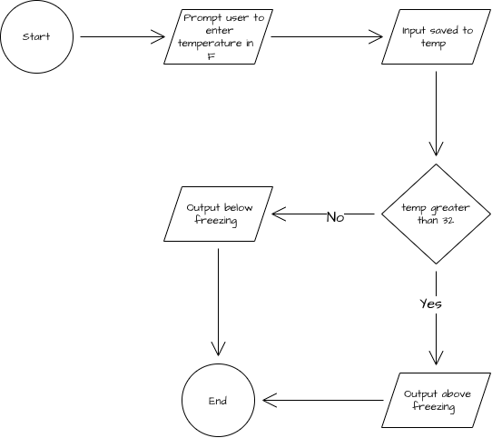

# Debugging Warm-Up 03

In this program, the user is prompted to enter a temperature in Fahrenheit and it outputs if the temperature is above or below freezing.

## Flow Chart



## Pseudocode

```
FUNCTION main()
    DECLARE temp : FLOAT

    OUTPUT "Enter the temperature in Fahrenheit"
    INPUT temp

    IF temp greater than or equal to 32:
        OUTPUT "Above freezing"
    ELSE
        OUTPUT "Below freezing"
    ENDIF
ENDFUNCTION
```
